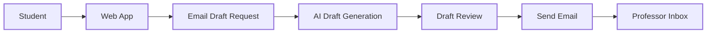
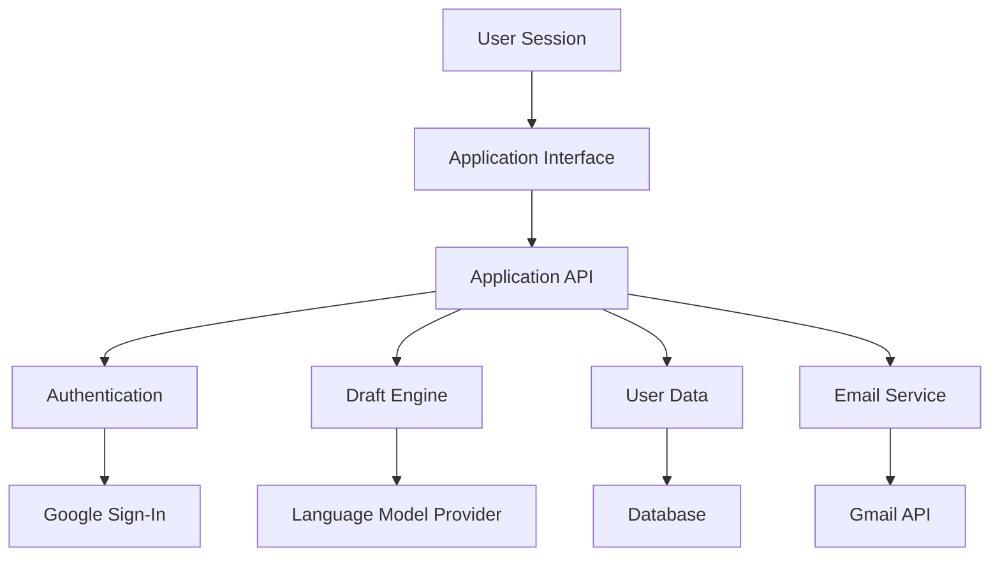
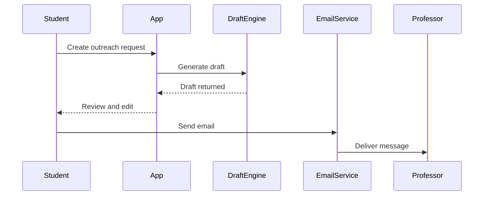

# AI-Assisted Professor Cold-Emailer

  A platform that helps students write thoughtful research outreach emails to professors.

  
  
  
  
  

---

## Platform Overview

AI-Assisted Professor Cold-Emailer helps students reach out to professors with clear, personalized research emails.  
The platform focuses on authenticity, clarity, and reducing the friction involved in academic outreach.

---

## Core Capabilities

<table>
<tr>
<td width="33%">

### Personalized Email Drafting
Generates outreach emails tailored to a student’s interests and a professor’s research work.

</td>
<td width="33%">

### Multi-User Platform
Students sign in securely and manage their outreach in one place.

</td>
<td width="33%">

### Direct Email Sending
Emails can be sent directly through connected Gmail accounts.

</td>
</tr>

<tr>
<td width="33%">

### Draft Control
Students can edit and refine every generated message.

</td>
<td width="33%">

### Secure Data Model
Each user’s data is isolated with strict access control.

</td>
<td width="33%">

### Research Outreach Workflow
Designed specifically for academic networking and mentorship.

</td>
</tr>
</table>

---

## System Flow

This diagram shows how a student request moves through the platform.

---

## Application Architecture

---

## Outreach Lifecycle

This shows the lifecycle of a research email inside the platform.

---

## What Makes This Platform Different

Most students send generic outreach emails or never reach out at all.  
This system is built to encourage thoughtful communication rather than templates.

Focus areas include:
- clarity
- personalization
- accessibility for students new to research outreach
- scalable multi-user design

---

## Roadmap

Planned improvements include:

Professor research analysis  
Publication-based personalization  
Response tracking  
Follow-up generation  
Outreach insights dashboard

---

## License

MIT License